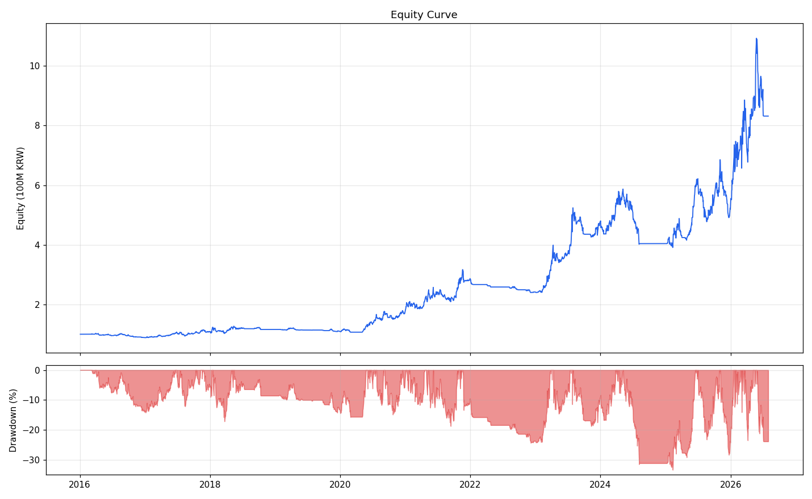

# 백테스트 결과 — 52주 신고가 모멘텀 v26 (RS 우선순위)

- 기간: 2016-01-04 ~ 2026-07-31
- 초기자본: 100,000,000원
- 최종자산: 831,873,885원

## 연도별 성과

| 연도 | 거래횟수 | 연수익률 | 승률 | 평균 수익 | 평균 손실 | 손익비 | MDD |
|---|---|---|---|---|---|---|---|
| 2016 | 55 | -11.44% | 25.5% | +5.08% | -4.27% | 1.19 | -14.04% |
| 2017 | 92 | +22.91% | 42.4% | +10.21% | -4.96% | 2.06 | -12.16% |
| 2018 | 45 | +6.48% | 35.6% | +17.26% | -6.43% | 2.68 | -17.18% |
| 2019 | 33 | -5.21% | 30.3% | +8.85% | -5.81% | 1.52 | -10.21% |
| 2020 | 91 | +57.87% | 48.4% | +13.87% | -7.17% | 1.93 | -14.90% |
| 2021 | 99 | +65.29% | 32.3% | +24.97% | -6.39% | 3.91 | -18.76% |
| 2022 | 27 | -15.66% | 11.1% | +3.59% | -6.44% | 0.56 | -15.12% |
| 2023 | 88 | +95.69% | 40.9% | +25.57% | -6.15% | 4.16 | -18.77% |
| 2024 | 91 | -14.62% | 23.1% | +21.69% | -7.05% | 3.08 | -31.53% |
| 2025 | 120 | +28.44% | 32.5% | +20.90% | -7.31% | 2.86 | -28.37% |
| 2026 | 114 | +60.31% | 29.8% | +25.84% | -8.35% | 3.09 | -23.89% |
| 전체 | 855 | +22.19% (CAGR) | 33.7% | +18.49% | -6.62% | 2.79 | -33.40% |

## 청산 사유별 통계

```
             건수     비중    평균수익률        총손익
reason                                    
MA20_EXIT   437  51.1%    7.81%   1597.9백만
STOP_INTRA  293  34.3%   -8.38%  -1203.0백만
BEAR_EXIT   100  11.7%    9.04%    536.5백만
STOP_GAP     25   2.9%  -11.53%   -199.6백만
```

## 진입 R 구간별 성과

```
      건수     비중    성공률   평균수익률      총손익
진입R                                    
2.0   32   3.7%   3.1%  -3.75%  -30.0백만
3.0  364  42.6%  15.9%   2.58%  210.7백만
4.0  359  42.0%  23.7%   2.03%  429.0백만
5.0   84   9.8%  15.5%   0.48%  138.0백만
6.0   16   1.9%   6.2%  -0.91%  -15.7백만
```

## 시장 국면별 성과

```
           건수     비중    성공률   평균수익률      총손익
국면                                          
강세(3.0R)  411  48.1%  21.9%   1.98%  605.9백만
약세(1.0R)   32   3.7%   3.1%  -3.75%  -30.0백만
횡보(2.0R)  412  48.2%  16.3%   2.13%  156.0백만
```

## 자산 곡선



## 수익률 상위 10개 매매

| 종목 | 코드 | 진입 | 청산 | 보유 | 수익률 | 진입R | 손익 | 청산사유 | 24%도달 |
|---|---|---|---|---|---|---|---|---|---|
| 에코프로 | 086520 | 2023-02-07 | 2023-05-09 | 91일 | +278.8% | 3.0R | 8,376만 | MA20_EXIT | O |
| 위메이드 | 112040 | 2021-09-01 | 2021-11-26 | 86일 | +255.7% | 4.0R | 9,205만 | MA20_EXIT | O |
| HD현대일렉트릭 | 267260 | 2024-02-14 | 2024-06-10 | 117일 | +127.5% | 3.0R | 7,123만 | MA20_EXIT | O |
| 포스코인터내셔널 | 047050 | 2023-06-08 | 2023-08-22 | 75일 | +111.8% | 5.0R | 8,238만 | MA20_EXIT | O |
| 성호전자 | 043260 | 2026-02-03 | 2026-03-31 | 56일 | +111.2% | 5.0R | 16,599만 | MA20_EXIT | O |
| 삼성전기 | 009150 | 2026-05-12 | 2026-07-03 | 52일 | +97.1% | 4.0R | 14,435만 | MA20_EXIT | O |
| 현대무벡스 | 319400 | 2025-12-22 | 2026-01-26 | 35일 | +96.6% | 4.0R | 7,911만 | BEAR_EXIT | O |
| 로보티즈 | 108490 | 2025-09-18 | 2025-11-18 | 61일 | +85.7% | 5.0R | 8,453만 | MA20_EXIT | O |
| 알테오젠 | 196170 | 2020-05-04 | 2020-06-04 | 31일 | +85.5% | 3.0R | 1,141만 | MA20_EXIT | O |
| 삼성전기 | 009150 | 2026-04-08 | 2026-05-07 | 29일 | +79.4% | 4.0R | 9,522만 | BEAR_EXIT | O |
